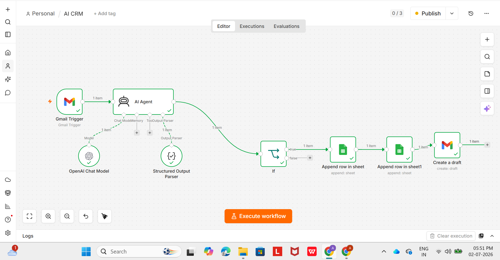
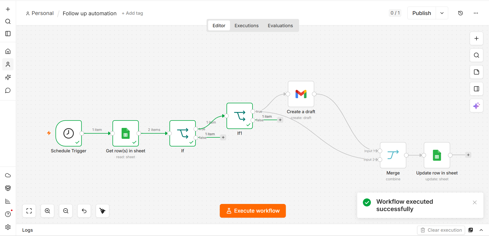
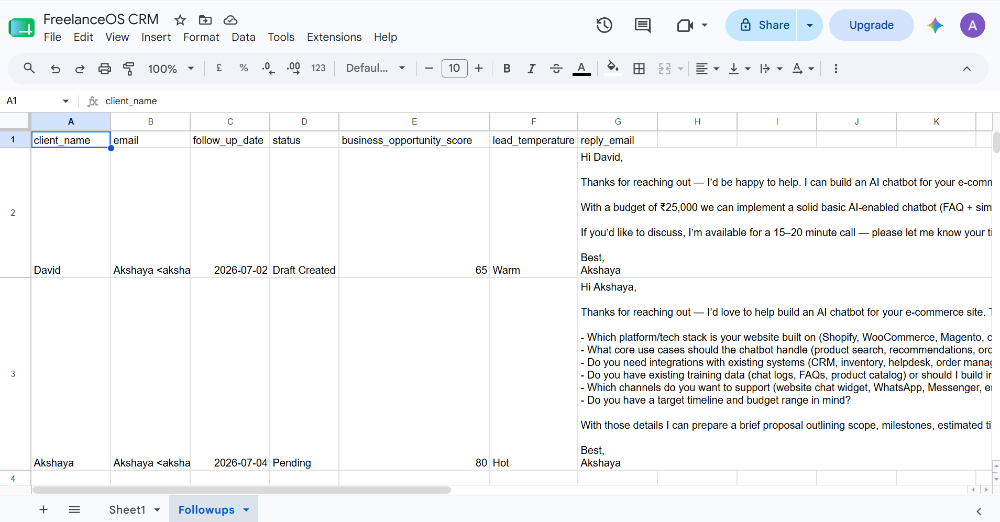
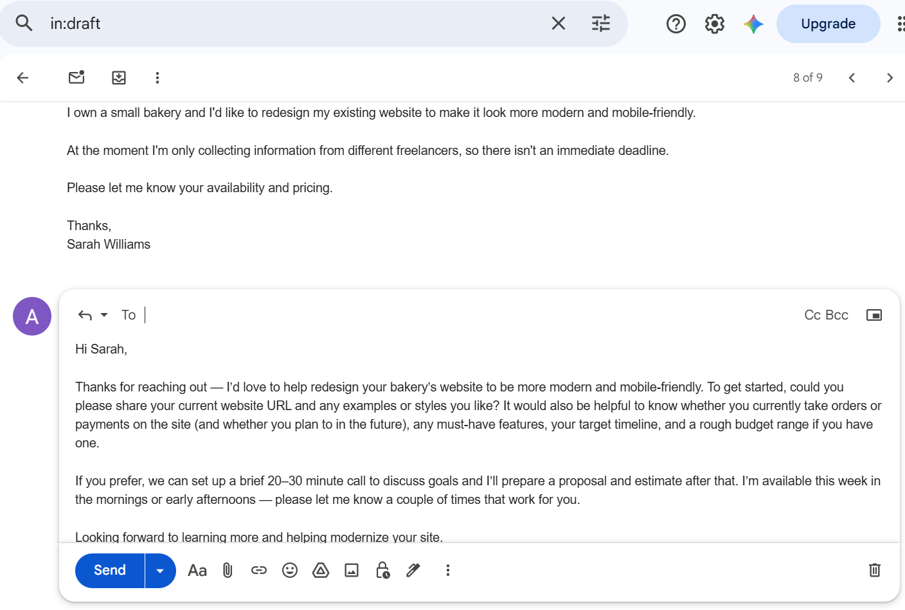
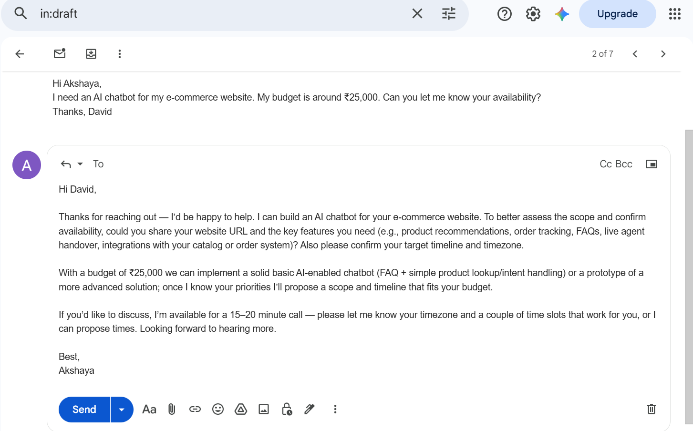
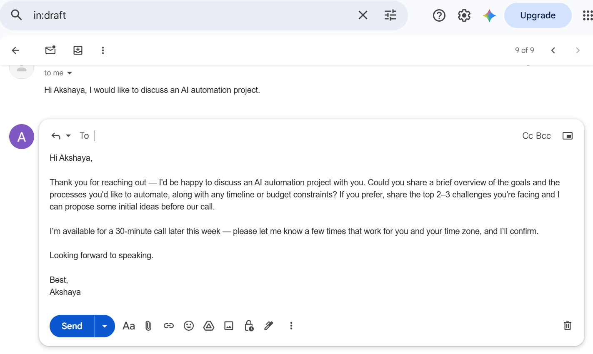

━━━━━━━━━━━━━━━━━━━━━━━━━━━━━━━

FreelanceOS AI CRM

AI-Powered Client Relationship Management

━━━━━━━━━━━━━━━━━━━━━━━━━━━━━━━

# FreelanceOS AI CRM


An AI-powered CRM that automatically analyzes client emails, scores leads, generates professional Gmail drafts, and manages automated follow-ups using n8n, OpenAI, Gmail, and Google Sheets.

## 🚀 Overview

FreelanceOS AI CRM is an AI-powered customer relationship management system built using n8n, OpenAI, Gmail, and Google Sheets.

The system automatically reads incoming client emails, analyzes them using AI, classifies business opportunities, generates professional Gmail draft replies, stores lead information in Google Sheets, and manages automated follow-up reminders.

---

## ❗ Problem

Freelancers often receive dozens of client emails every week.

Manually reading, replying, tracking leads, and remembering follow-ups wastes time and causes missed opportunities.

## 💡 Solution

FreelanceOS AI CRM is an AI-powered workflow automation system designed to simplify client communication for freelancers and small businesses.

The system automatically monitors incoming Gmail messages, uses an AI agent to analyze email content, identifies potential business opportunities, extracts client information, assigns lead scores, and stores the data in Google Sheets. It also generates professional Gmail draft replies and automates follow-up reminders based on scheduled dates.

By combining n8n, OpenAI, Gmail, and Google Sheets, the solution reduces repetitive manual tasks, improves response time, and helps users manage client relationships more efficiently while minimizing the risk of missed opportunities.

## ✨ Features

- 📩 Automatic Gmail Monitoring
- 🤖 AI Email Analysis
- 🧠 Client Information Extraction
- 📊 Business Opportunity Scoring
- 🔥 Lead Temperature Classification (Hot / Warm / Cold)
- ✉️ AI-Generated Gmail Draft Replies
- 📄 Google Sheets CRM
- 📅 Automated Follow-up Management
- ⏰ Daily Follow-up Scheduler
- ✅ Automatic Status Updates

---

## 🛠 Tech Stack

- n8n
- OpenAI
- Gmail API
- Google Sheets
- AI Agent
- Structured Output Parser

---

## 📂 Project Structure

```
workflows/
├── FreelanceOS_AI_CRM.json
└── FreelanceOS_Followup_Manager.json
```

---

## 🚀 Getting Started

Follow these steps to set up and run the project:

1. Clone this repository or download the workflow files.
2. Import the workflow JSON files into your n8n instance.
3. Configure the required credentials:
   - Gmail
   - OpenAI API
   - Google Sheets
4. Update the workflow with your own API keys and spreadsheet IDs.
5. Execute the workflow and test the automation.

> **Note:** This project requires a configured n8n environment and valid API credentials for all connected services.

📥 AI Email Processing Workflow

Incoming Gmail

↓

AI Agent

↓

Lead Analysis

↓

Google Sheets CRM

↓

Gmail Draft

---

📅 Automated Follow-up Workflow

Schedule Trigger

↓

Read Follow-up Sheet

↓

Check Pending Leads

↓

Check Follow-up Date

↓

Create Follow-up Draft

↓

Update Status

---

## 🎯 Future Improvements

- Duplicate Lead Detection
- CRM Dashboard
- Telegram Notifications
- Slack Integration
- Calendar Integration
- AI Client Memory
- Analytics Dashboard

---
## 📸 Screenshots

### Workflow 1 - AI CRM



### Workflow 2 - Follow-up Automation



### CRM Sheet



### Gmail Drafts







👩‍💻 About the Author

Akshaya V is a Computer Science undergraduate passionate about AI Automation, Workflow Automation, and Software Development.

LinkedIn:https://www.linkedin.com/in/akshaya-v-0199233ab/

## ⭐ Like this project?

If you enjoyed exploring this project, don't forget to leave a ⭐ on the repository. It helps others discover the project and motivates me to keep building.
